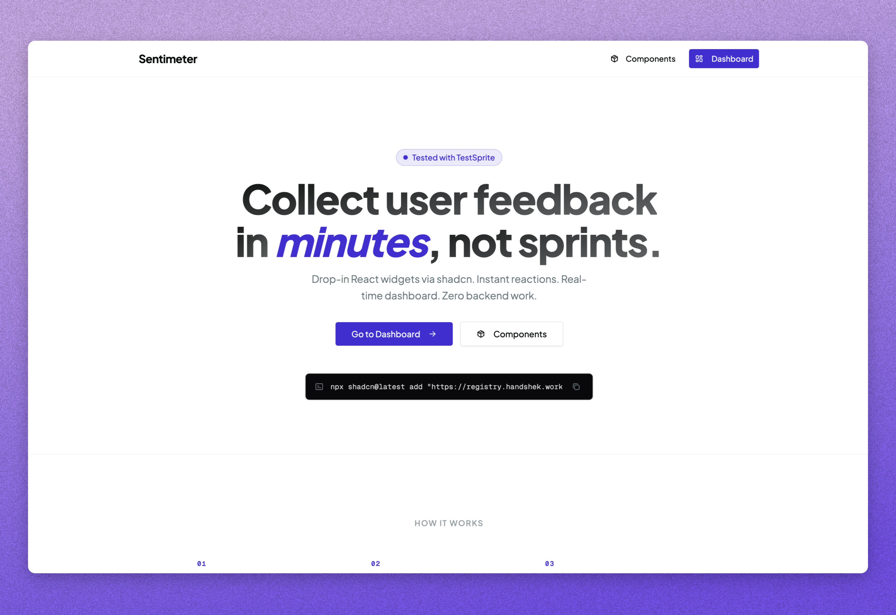

# Sentimeter

Sentimeter is a shadcn-first feedback system. Install the open-code widgets into your existing shadcn project, let them adapt to your app's UI, and get real-time analytics on a hosted dashboard.



```bash
npx shadcn@latest add "https://registry.handshek.workers.dev/r/emoji-feedback.json"
```

---

## Links

- **Live:** [https://try-sentimeter.vercel.app](https://try-sentimeter.vercel.app)
- **YT Demo:** [https://youtu.be/EdtzrnbjEVI](https://youtu.be/EdtzrnbjEVI)

## How it works

```
  Developer installs widget        End user reacts        Developer sees it live
  ──────────────────────────       ───────────────        ──────────────────────
  shadcn add Sentimeter        →   clicks 😍              dashboard updates
  into their own project           hits POST /feedback →  instantly, no refresh
```

Sentimeter is designed to drop into the user's own shadcn/ui setup and inherit that project's component structure, styling, and install flow.

Three moving parts:

```
  ┌──────────────────┐   ┌──────────────────┐   ┌──────────────────┐
  │  apps/registry   │   │    apps/web      │   │   Convex Cloud   │
  │  Hono + CF       │   │   Next.js 16     │   │   DB + HTTP      │
  │  Workers         │   │   Vercel         │   │   actions        │
  │                  │   │                  │   │                  │
  │  Serves widget   │   │  Dashboard +     │   │  Stores feedback │
  │  registry JSON   │   │  analytics       │   │  Validates keys  │
  │  via shadcn      │   │  Clerk auth      │   │  Reactive subs   │
  └──────────────────┘   └─────────┬────────┘   └─────────┬────────┘
                                   │                      │
                                   └──── useQuery ────────┘
                                         (realtime)
```

---

## Stack

| Component | Tech / Service                                       |
| --------- | ---------------------------------------------------- |
| Monorepo  | Turborepo + Bun                                      |
| Dashboard | Next.js 16, Tailwind CSS v4, shadcn/ui               |
| Auth      | Clerk → Convex (JWT)                                 |
| Backend   | Convex (realtime DB, server functions, HTTP actions) |
| Registry  | Hono + Cloudflare Workers                            |
| Testing   | TestSprite MCP                                       |

---

## Getting started

**Prerequisites:** [Bun](https://bun.sh), Node ≥ 18

```bash
git clone <repo> && cd sentimeter
bun install
```

**1. Convex** — Create a project at [convex.dev](https://convex.dev). On first setup, Convex may prompt you to log in or choose a project when the dev loop starts.

When Convex is configured, make note of the `NEXT_PUBLIC_CONVEX_URL` and `NEXT_PUBLIC_CONVEX_SITE_URL` values it prints.

**2. Clerk** — Create an app at [clerk.com](https://clerk.com). Copy the publishable and secret keys. Set the JWT issuer domain in your Convex dashboard:

```
CLERK_JWT_ISSUER_DOMAIN = https://<instance>.clerk.accounts.dev
```

**3. Env file**

```bash
cp apps/web/.env.example apps/web/.env.local
# fill in Convex + Clerk values
```

**4. Run**

```bash
bun run dev
# Dashboard → http://localhost:3000/dashboard
# Widgets   → http://localhost:3000/widgets
# Convex    → runs alongside Next.js in the Turborepo terminal UI
```

---

## Environment variables

**`apps/web/.env.local`**

| Variable                            | Purpose                        |
| ----------------------------------- | ------------------------------ |
| `NEXT_PUBLIC_CONVEX_URL`            | Convex deployment URL          |
| `NEXT_PUBLIC_CONVEX_SITE_URL`       | Convex site URL (HTTP actions) |
| `NEXT_PUBLIC_CLERK_PUBLISHABLE_KEY` | Clerk publishable key          |
| `CLERK_SECRET_KEY`                  | Clerk secret key               |

**Convex dashboard**

| Variable                  | Purpose                   |
| ------------------------- | ------------------------- |
| `CLERK_JWT_ISSUER_DOMAIN` | Clerk Frontend API domain |

**`apps/registry`** has no env vars. The feedback endpoint is compiled into registry output at build time, so the generated components stay aligned with the shadcn project they were installed into.

---

## Commands

| Command                  | What it does                                       |
| ------------------------ | -------------------------------------------------- |
| `bun run dev`            | Dashboard, widgets, and Convex dev servers         |
| `bun run build`          | Build everything                                   |
| `bun run registry:build` | Generate registry JSON → `apps/registry/public/r/` |
| `bun run lint`           | Lint the monorepo                                  |
| `bun run check-types`    | Type-check                                         |

Registry deploy (from `apps/registry`):

```bash
bun run registry:build
bun run deploy
```

---

## Challenges

**Clerk two-step sign-in** — Clerk's flow is email → Continue → password → Continue, not a single form. TestSprite tests follow this sequence explicitly.

**TestSprite plan overwrite** — An empty MCP response overwrote the test plan JSON. Fixed by maintaining the plan manually and calling `generate_code_and_execute` directly.

**Vercel monorepo deploy** — Setting the Vercel project root to `apps/web` caused `npm install` to run in isolation and break workspace deps. Fixed by deploying from repo root so Turborepo resolves the full workspace.

**Registry install DX** — Using a scoped package name in `registryDependencies` forced consumers to edit `components.json`. Switched to full URLs so `bunx shadcn add <url>` works with zero config and the components adapt cleanly inside the user's shadcn project.

**Widget feedback endpoint** — Baked the production Convex site URL directly into `packages/widgets/src/core/submit.ts` and into registry-built output so installed widgets always hit the correct backend.

---

## Roadmap

- Production Clerk instance + custom domain (Clerk blocks production on `*.vercel.app`)
- Additional widget variants and theme options
- Rate limiting and origin allowlist on the public feedback endpoint
- Public embed guide and HTTP API docs

---

## License

Licensed under the MIT License.
