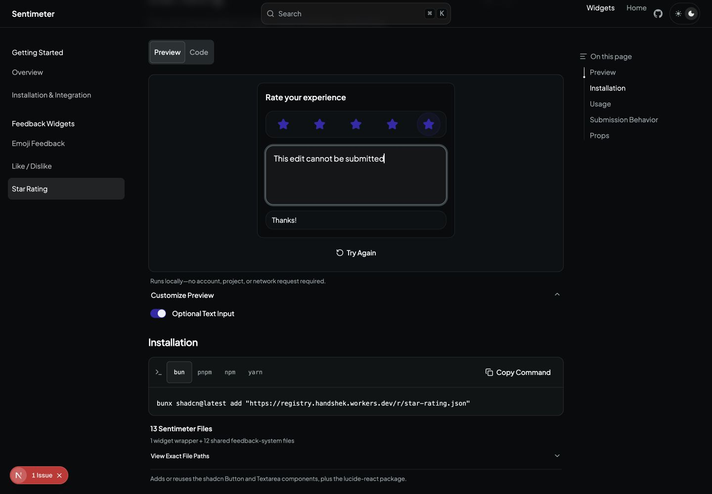
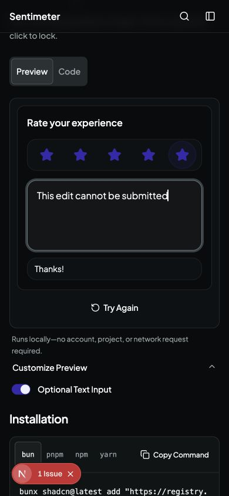
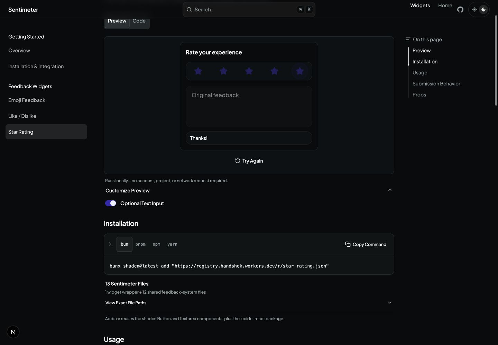
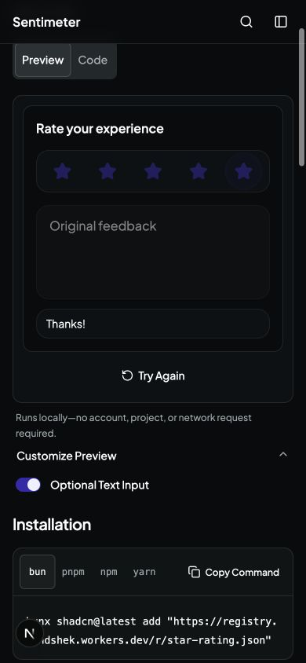

# Completed widget controls evidence

Issue [17](https://github.com/handshek/sentimeter/issues/17) affects users who keep a completed widget mounted. Its field accepted unsavable edits, and star previews could disagree with the submitted rating.

## Repeat the browser check

1. Run the public app from this checkout on an unused local port.
2. Open `/components/star-rating`.
3. Expand Customize Preview and enable Optional Text Input.
4. Select five stars, enter `Original feedback`, and click Submit.
5. After `Thanks!`, attempt to edit the text or select another rating.
6. Click Try Again and verify that a new selection and text entry work.

Before the fix, the field could display `This edit cannot be submitted` with no Submit action. After the fix, completed controls are disabled and preserve `Original feedback` and the five-star selection. Try Again resets the local demo.

## Browser captures

These are real public local UI captures. The baseline is `ea286396fed6e1d04e9ecd757dd47329d5ff7b03` on port 3020. The fix ran from its separate checkout on port 3021. Desktop is 1440 by 1000 pixels. Mobile is 390 by 844 pixels. The theme is dark. No account or hosted backend is configured. Local completion does not persist data.

| State  | Desktop                                                       | Mobile                                                      |
| ------ | ------------------------------------------------------------- | ----------------------------------------------------------- |
| Before |  |  |
| After  |     |     |

## Regression evidence

The new `packages/widgets/src/feedback-completion.test.tsx` runs against the actual rendered presets with custom-submit fixtures. It covers all six visual styles, pending and completed controls, reset, corrections after errors, and locked star previews. These tests capture submitted payloads in memory. They do not verify Convex persistence.

The same test file failed 14 cases before the implementation and passed 14 after it. See [before log](regression-before.log) and [after log](regression-after.log).

All repository-required checks passed, including lint, types, tests, build, registry reconstruction, docs, and test inclusion. Registry verification builds and type-checks a reconstructed host fixture. It does not perform a remote install into a separate customer application.
