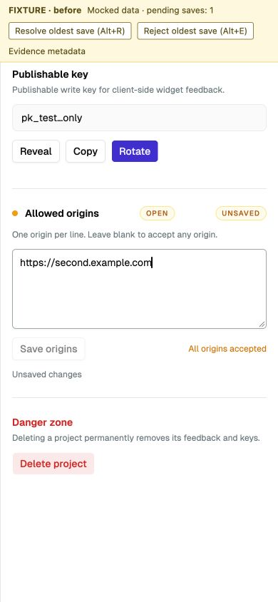
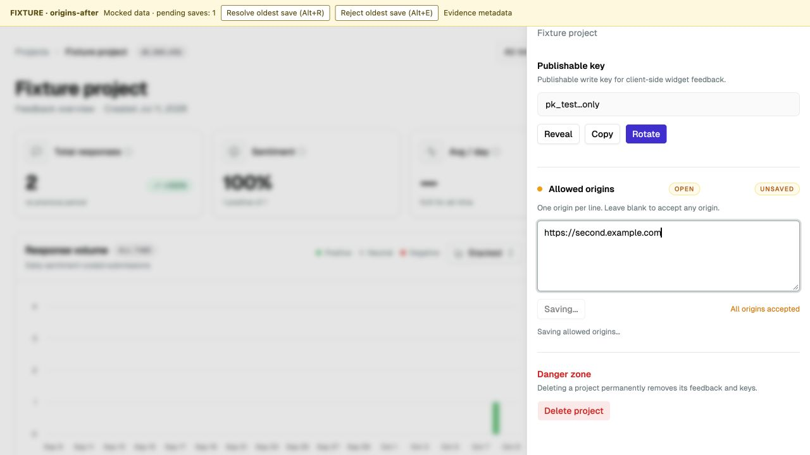
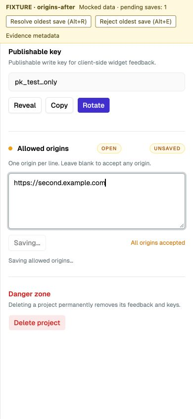
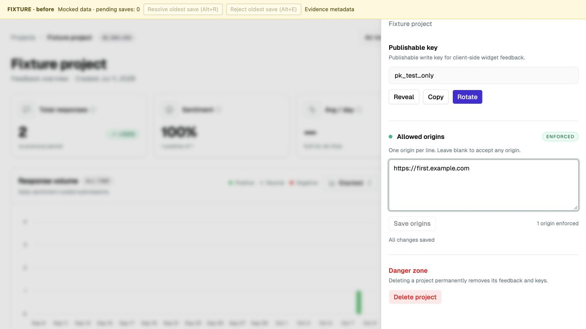
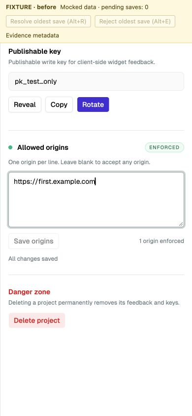
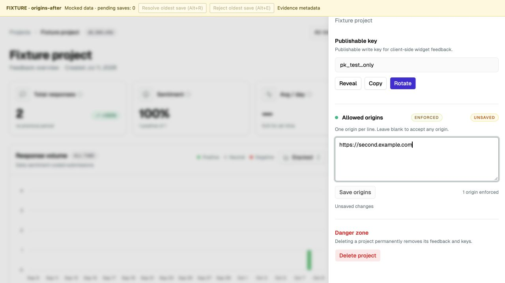
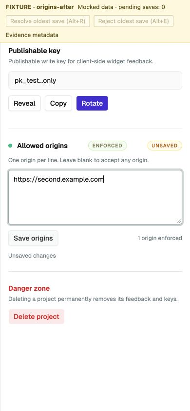

# Pending origin save evidence

Issue [19](https://github.com/handshek/sentimeter/issues/19): a pending save discarded newer edits and re-enabled Save before the request completed.

## Repeat the reproduction

The existing component harness uses a deferred `updateAllowedOrigins` response. From `apps/web`, run `bun test app/dashboard/_components/project-client.test.tsx` and `bun test app/dashboard/_components/project-settings-state.test.ts`. The new cases fail against the recorded baseline: 4 reducer failures and 2 component failures. After the fix all 8 reducer and 13 component tests pass. The original independent reproduction also passes; see the before/after logs.

For the browser check, render the real ProjectClient with the same deferred mutation adapter, open Settings, enter `https://first.example.com`, and start saving. While pending, edit to `https://second.example.com`, then resolve the first request with the normalized first origin. Before: Save becomes available early and the response replaces the second draft. After: Save remains disabled while pending; the response retains the second origin as an unsaved draft and advances the saved baseline. Rejection retains the draft and retry. Pending discard/reopen and later hydration are covered by the existing reducer/component harness.

## Captures and environment

These are actual browser captures of the real component with fixture adapters, not a hosted dashboard. The yellow FIXTURE banner remains visible. Desktop is 1280x720 and mobile is 390x844. [Baseline](baseline.json) and browser [before](browser-before.json)/[after](browser-after.json) metadata record source and environment. No real backend mutation, persistence, Clerk session or Convex subscription is verified.

| State           | Desktop                                                              | Mobile                                                      |
| --------------- | -------------------------------------------------------------------- | ----------------------------------------------------------- |
| Pending before  |     |  |
| Pending after   |  |    |
| Resolved before |                        |      |
| Resolved after  |                    |  |

All repository checks passed; see [validation](validation.txt), the [fresh native review](review.md), and regression logs. Claude review was skipped at the user's request. `apps/web/vercel.json` suppresses automatic deployment for `codex/*` task branches under the no-deploy constraint. This PR targets master independently.
