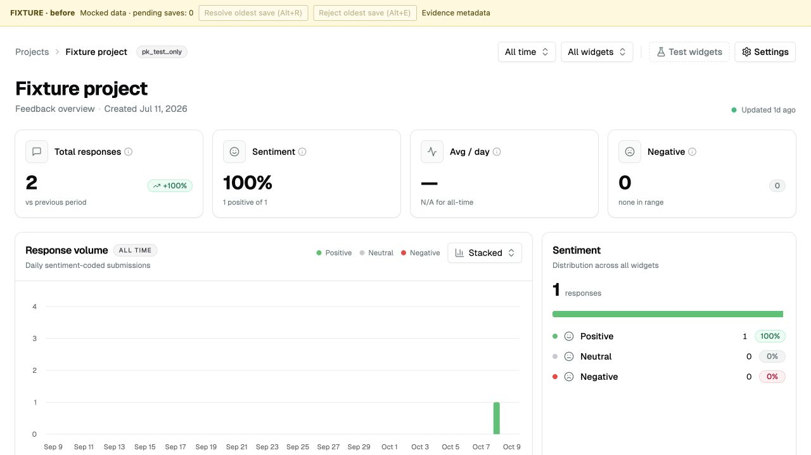
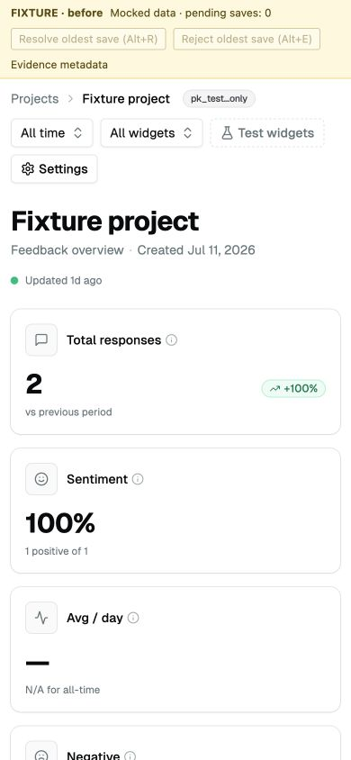
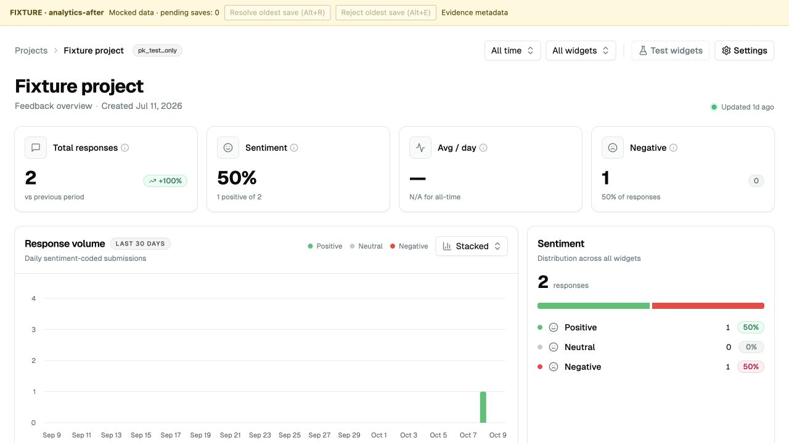
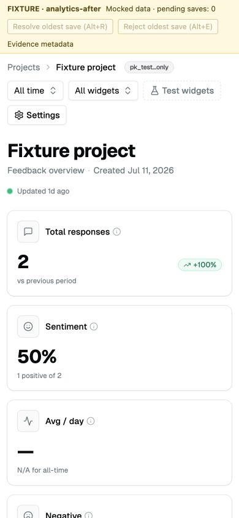

# All-time sentiment evidence

Issue [20](https://github.com/handshek/sentimeter/issues/20): all-time sentiment and distribution excluded feedback older than the volume chart's intentional 30-day bound.

## Repeat the reproduction

From `apps/web`, run `bun test app/dashboard/_components/project-client.test.tsx`. Nine new cases protect all-time totals, mixed widget sentiment and neutrals, selected widget and bounded ranges, loading, empty data, and truthful chart labels. The suite fails 6 cases against the baseline and passes all 19 cases after the fix. The original independent two-row reproduction also passes; see the logs.

The fixed browser fixture executes the checkout's actual registered `getAnalytics`, `getVolumeSeries` and feed handlers against an in-memory database at `2026-10-09T12:00:00Z`. Its two records are one one-star response 60 days old and one five-star response yesterday. The real ProjectClient then renders these query results with mocked Convex hooks, auth and routing. Select All time and All widgets. Expected total 2, sentiment 50%, negative 1. Before: sentiment 100%, negative 0, distribution total 1 and volume labeled ALL TIME. After: full analytics bins supply sentiment/distribution; the intentionally bounded chart and accessible summary say last 30 days. [Exact fixture query outputs](query-fixture.json) and [handler reproduction](query-reproduction.log) distinguish query behavior from UI behavior.

## Captures and environment

These are actual browser captures with the yellow FIXTURE banner. Desktop is 1280x720 and mobile is 390x844. [Baseline](baseline.json) and browser [before](browser-before.json)/[after](browser-after.json) metadata record source and environment. The in-memory handler adapter does not verify Convex validation, indexes, transactions, hosted subscriptions, auth or persistence. No real backend mutation occurred.

| State  | Desktop                                                                 | Mobile                                                       |
| ------ | ----------------------------------------------------------------------- | ------------------------------------------------------------ |
| Before |  |  |
| After  |         |     |

All repository checks passed; see [validation](validation.txt), the [fresh native review](review.md), and component regression logs. Claude review was skipped at the user's request. `apps/web/vercel.json` suppresses automatic deployment for `codex/*` task branches under the no-deploy constraint. This PR targets master independently and retains the existing backend query contracts and bounded volume scan.
